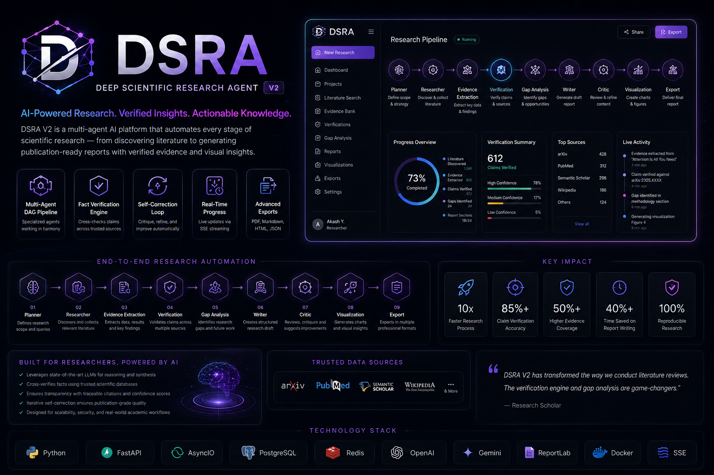

# Akash Yaduwanshi — AI Engineer Portfolio

> **Architecting the autonomous future.** A highly interactive, cinematic 3D neural experience showcasing projects, capabilities, and technical stack.



## 🌌 Overview

This is a high-performance, 3D interactive web portfolio built with **React Three Fiber** and **GSAP**. It replaces static, traditional scrolling with a cinematic, data-driven "neural network" concept where projects orbit as glass-morphic DNA strands. 

The entire content layer is strictly decoupled into a single JSON file, allowing for instantaneous text and project updates without touching the complex 3D WebGL rendering logic.

## 🚀 Tech Stack

- **Core**: React 19, TypeScript, TanStack Start (SSR/Nitro)
- **3D & WebGL**: Three.js, React Three Fiber (R3F), React Three Drei
- **Post-Processing**: `@react-three/postprocessing` (Bloom & cinematic effects)
- **Animation**: GSAP (ScrollTrigger) & Custom GLSL Shaders
- **Styling**: TailwindCSS 4
- **Deployment**: Optimized for Vercel edge via Nitro

## ✨ Key Features

- **Data-Driven CMS**: All text, projects, tech stacks, and links are dynamically loaded from `src/data/content.json`.
- **Custom GLSL Shaders**: Uses bespoke simplex noise fluid shaders and water-ripple displacement maps.
- **Scroll-Tied Timeline**: Implements `GSAP ScrollTrigger` with a flywheel lag effect, directly manipulating the camera and 3D globe phase on scroll.
- **Dynamic Projects**: The "DNA Strand" auto-generates layout, colors, and physical positioning based on the array size inside `content.json`.
- **Zero-Bloat Bundle**: Carefully pruned to exclude unused UI libraries (stripped 400KB+ of unused Radix UI and charting components).

## 📂 Project Structure

```text
├── src/
│   ├── components/
│   │   └── axon/
│   │       ├── Experience.tsx   # Core R3F Canvas and 3D Scene orchestrator
│   │       └── Transitions.tsx  # Specialized WebGL transition components
│   ├── data/
│   │   └── content.json         # 🔴 Source of truth for ALL text/projects
│   ├── routes/
│   │   ├── __root.tsx           # Global layouts and SEO metadata
│   │   └── projects.tsx         # Classic 2D fallback view of all projects
│   └── styles.css               # Global Tailwind CSS definitions
├── vite.config.ts               # Bundler configuration (Nitro + Vercel preset)
└── package.json                 # Dependency management
```

## 🛠️ Local Development

1. **Install dependencies:**
   ```bash
   npm install
   # or
   bun install
   ```

2. **Start the development server:**
   ```bash
   npm run dev
   ```
   The site will be available at `http://localhost:5173`

3. **Production Build:**
   ```bash
   npm run build
   npm run preview
   ```

## 📝 Updating Content

To update the portfolio (add new projects, change your bio, update socials), simply edit `src/data/content.json`. 

The 3D scene (like the DNA strand height and project card orbiting angles) will mathematically adjust itself automatically to accommodate new entries.

## ☁️ Deployment

This project is natively configured for **Vercel**. 

The `vite.config.ts` utilizes the Nitro `vercel` preset to handle TanStack Start SSR out-of-the-box.

1. Install Vercel CLI (or connect via GitHub):
   ```bash
   npm i -g vercel
   ```
2. Deploy:
   ```bash
   vercel deploy --prod
   ```

## 📄 License
Designed & Built for Akash Yaduwanshi. All Rights Reserved.
